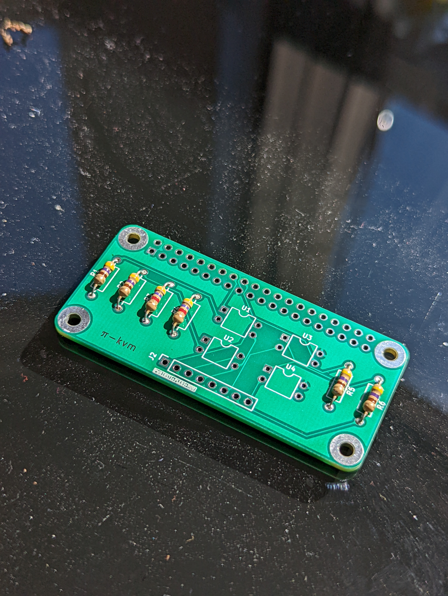

# PCBs
## PiKVM
The [PiPVM](https://github.com/pikvm/pikvm) project requires some additional hardware for ATX system control.

This PCB implements the circuit from this section: <https://github.com/pikvm/pikvm#setting-up-the-v2> in a Raspberry Pi uHat footprint, per the specification at <https://github.com/raspberrypi/hats>.

